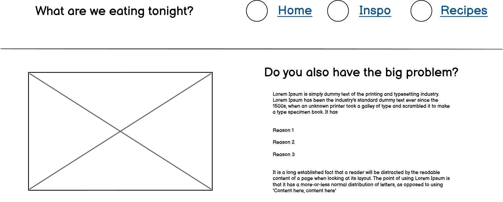
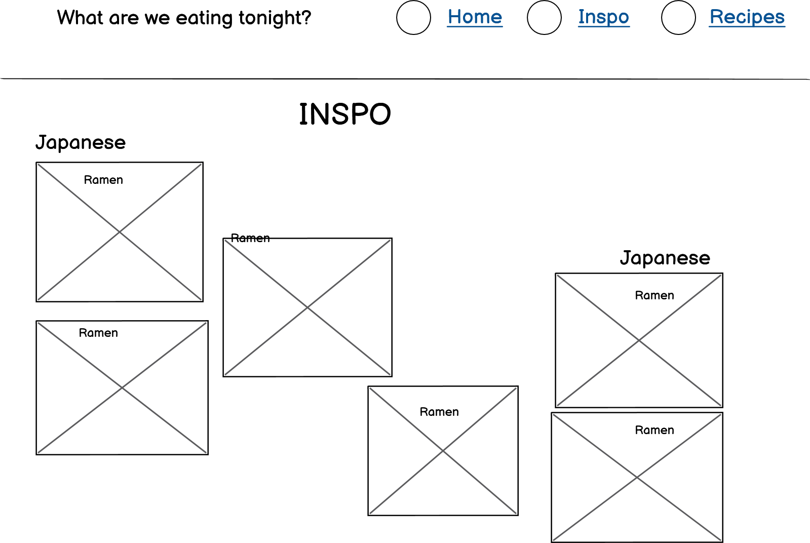
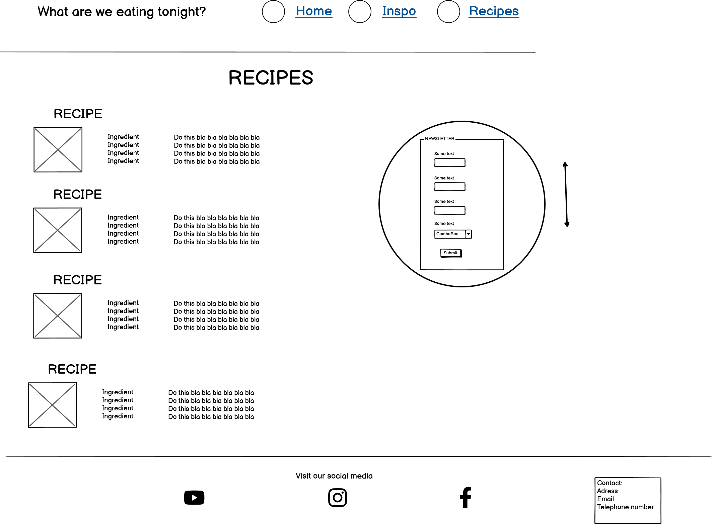

# What are we eating tonight?

One of my biggest recurring problems in life is that I each day must figure out what I am going to cook for dinner. This website solves that problem.

In a easy way the visitor can instantly get either top inspiration to all kinds of delicious dishes from all around the world *or* get their hands on some super easy and quick recipes.

image of the finished site on all devices, use https://ui.dev/amiresponsive

Find the site [here](https://mikael-johnsson.github.io/what-are-we-eating/)

## Contents

- [User Experience](#user-experience)
  - [User Stories](#user-stories)
- [Design](#design)
  - [Colour Scheme](#colour-scheme)
  - [Typography](#typography)
  - [Imagery](#imagery)
  - [Wireframes](wireframes)
- [Features](#features)
  - [General Features on Each page](#general-features-on-each-page)
  - [Future Implementations](#future-implementations)
  - [Accessibility](#accessibility)
- [Technologies Used](#technologies-used)
  - [Languages Used](#languages-used)
  - [Frameworks, Libraries & Programs Used](#frameworks-libraries--programs-used)
- [Deployment & Local Development](#deployment--local-development)
  - [Deployment](#deployment)
  - [Local Development](#local-development)
    - [How to Fork](#how-to-fork) 
    - [How to Clone](#how-to-clone)
- [Testing](#testing)
- [Credits](#credits)
  - [Code Used](#code-used)
  - [Content](#content)
  - [Media](#media)
  - [Acknowledgments](#acknowledgments)

## User Experience
When you are hangry and desperate for some inspiration, a time consuming website should not be your next problem. This site is designed to be quick to use.

### User Stories
First time visitors should instantly get an overview of the site and get to know that this is a site that offers both inspiration and easy recipes.

Recurring visitors that know what they are looking for should be able to quickly get to the preferred page.

## Design
### Colour Scheme

Red and yellow are known for triggering apetite. Remaining colours are preferred contrasting colours according to coolors.co from which the pallette is taken.

The plum color is used for text and borders. Remaining colours are background colours: red for header and footer, yellow for landing page, teal for inspiration page and lavender for recipe page.
### Typography
The site uses two fonts: "Poppins" for general text and "Madimi One" for headings. 

"Madimi One" is a fun, almost brush like font. It is a quite bold font, used in uppercase to make it stand out.

"Poppins" is a sans serif-font, a bit more easy to read.
### Imagery
Images are taken from pexels.com and Google pictures. All images are licensed to use in commercial products. 

Images to recipes and inspiration dishes are taken from above inside a round container (made round to resemble a plate). Food pictures taken from straight above is a common practice by food influencers and gives the visitor a consequent design.
### Wireframes 
These where the original ideas for the three different sections:

It is easy to see where the initial design idea differs from the result. The content in the Inspo page used the space to inefficiently and a simpler design were used instead.

The contact feature in the footer was deleted due to not contributing to the user in this particular site.
## Features
This site contain three different sections in a single html-page:
- Landing page
- Inspo page
- Recipe page
### General Features on each page
**The Landing page** gives the visitor a short summary of what the page does and a navigation bar to easily get to the most important content.

**The Inspo page** gives the visitor inspiring pictures with the names of the dishes, categorized under cuisine.

**The Recipe page** gives the visitor quick and easy recipes with 3-5 ingredients that takes only a few miuntes to assemble. The recipe also have a feature where the visitor can sign up for the newsletter, for even more inspiration and recipes. The newsletter sign up-feature is located at the top of the recipe page. When using desktop it sticks to the top of the page when scrolling down. When using smaller screens it is revealed when clicking the newsletter-label.

The header sticks at the top of the viewport and gives the visitor access to the navigation bar anywhere on the site.

At the bottom the visitor find the footer which contain links to the social media accounts.

The site is responsive - the design changes to be more compatible depending on which screen size the visitor uses.
### Future Implementations
The site has an infinite number of possibilites to incorporate. Some features that are planned but not yet executed are:
- The possibility for the visitor to enter preferred dishes and/or cuisines and get suggestions based on those preferences. 
- The possibility for the site to make suggestions based on what vegetables and fruits are in season in the visitors country at the moment. For a cheaper and more environment-friendly dish.
- The possibility for the site to gather information about prices at shops local to the visitor. For a cheaper dish.
- The possibility for the visitor to log what dishes and/or cuisines the visitor have eaten in the recent days/weeks and get suggestions based on those logs. For a more diverse eating experience.

### Accessibility
The site is made to be accessible. Measures taken are:
- High colour contrast between backround and text
- Alt attributes on all images
- Aria labels on all icons

## Technologies Used

### Languages Used
HTML and CSS were used to create this website.
### Frameworks, Libraries & Programs Used
Google Fonts -  For fonts

Git - For version control

Github - To save & store files and deployment

Font Awesome - For icons used in header and footer

Balsamiq - For wireframes
## Deployment & Local Development

### Deployment
incstructions on how to deploy your project most likely github pages
### Local Development
how could someone else make a copy of the project on the local machine
#### How to Fork
incstructions
#### How to Clone
incstructions
##Testing
link to eventuell testing.Md 
## Credits
text
### Code Used
Code to create navigation bar when using smaller devices where greatly inspired by the Love Running project of Code Institute.
### Content    
Recipes are taken from swedish recipe site https://www.köket.se
### Media
Images are taken from:

pexels.com

google.com
### Acknowledgments

