# What are we eating tonight?

One of my biggest recurring problems in life is that I each day must figure out what I am going to cook for dinner. This website solves that problem.

In an easy way the visitor can instantly get either top inspiration to all kinds of delicious dishes from all around the world *or* get their hands on some super easy and quick recipes.

Find the link to the site [here](https://mikael-johnsson.github.io/what-are-we-eating/)

This site is a part of the Code Institute Fullstack Software Developer program - portfolio project 1.


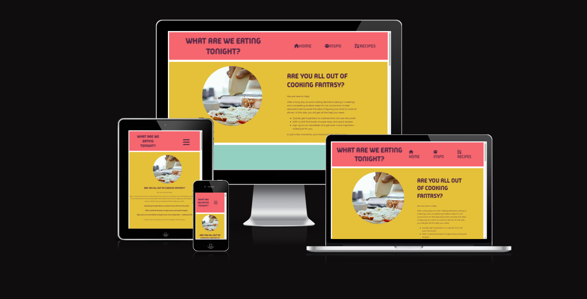


## Contents

- [User Experience](#user-experience)
  - [User Stories](#user-stories)
- [Design](#design)
  - [Colour Scheme](#colour-scheme)
  - [Typography](#typography)
  - [Imagery](#imagery)
  - [Wireframes](#wireframes)
- [Features](#features)
  - [General Features on Each page](#general-features-on-each-page)
  - [Future Implementations](#future-implementations)
  - [Accessibility](#accessibility)
- [Technologies Used](#technologies-used)
  - [Languages Used](#languages-used)
  - [Frameworks, Libraries & Programs Used](#frameworks-libraries--programs-used)
- [Deployment & Local Development](#deployment--local-development)
  - [Deployment](#deployment)
  - [Local Development](#local-development)
    - [How to Fork](#how-to-fork) 
    - [How to Clone](#how-to-clone)
- [Testing](#testing)
- [Credits](#credits)
  - [Code Used](#code-used)
  - [Content](#content)
  - [Media](#media)
  - [Acknowledgments](#acknowledgments)

## User Experience
When you are hangry and desperate for some inspiration, a time consuming website should not be your next problem. This site is designed to be quick to use.

### User Stories
First time visitors should instantly get an overview of the site and get to know that this is a site that offers both inspiration and easy recipes.

Recurring visitors that know what they are looking for should be able to quickly get to the preferred page.

## Design
### Colour Scheme
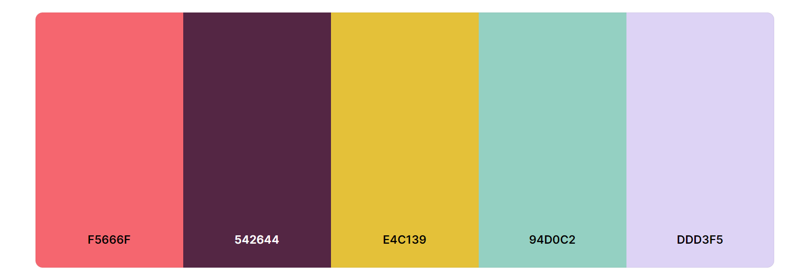

Red and yellow are known for triggering apetite. Remaining colours are preferred contrasting colours according to coolors.co from which the pallette is taken.

The plum color is used for text and borders. Remaining colours are background colours: red for header and footer, yellow for landing page, teal for inspiration page and lavender for recipe page.


### Typography
The site uses two fonts: "Poppins" for general text and "Madimi One" for headings. 


"Madimi One" is a fun, almost brush like font. It is a quite bold font, used in uppercase to make it stand out.


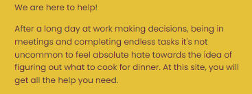


"Poppins" is a sans serif-font, easier to read.
### Imagery
Images to recipes and inspiration dishes are taken from above. Food pictures taken from straight above is a common practice by food influencers and generates a consequent design of the site.


### Wireframes 
These were the original ideas for the three different sections:

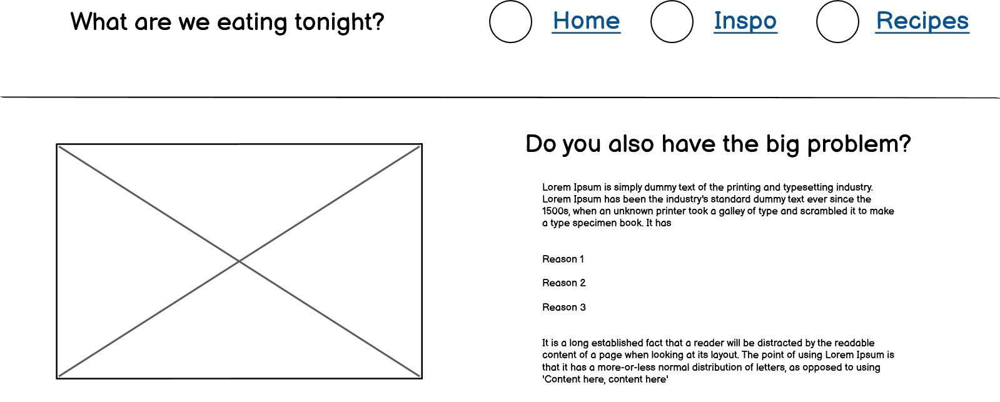
***
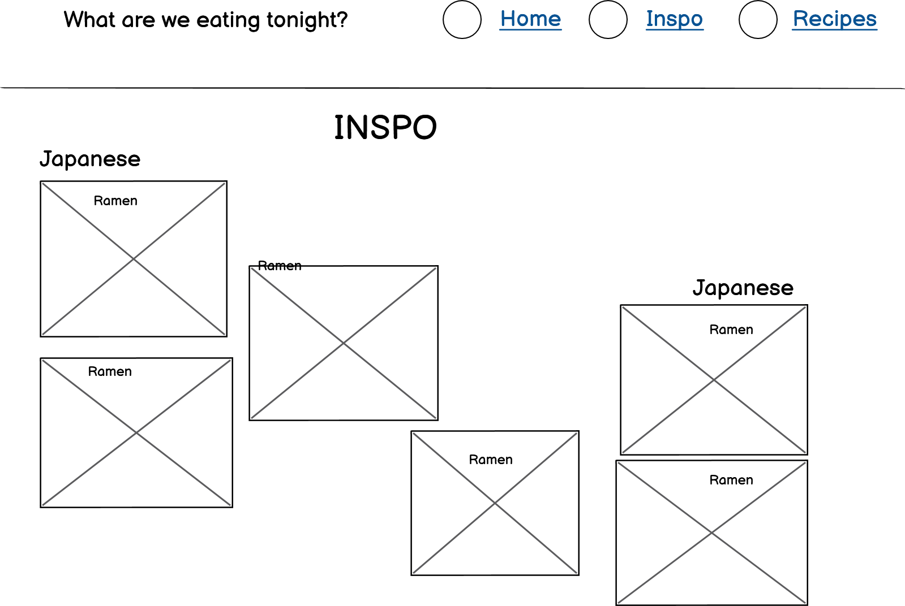
***
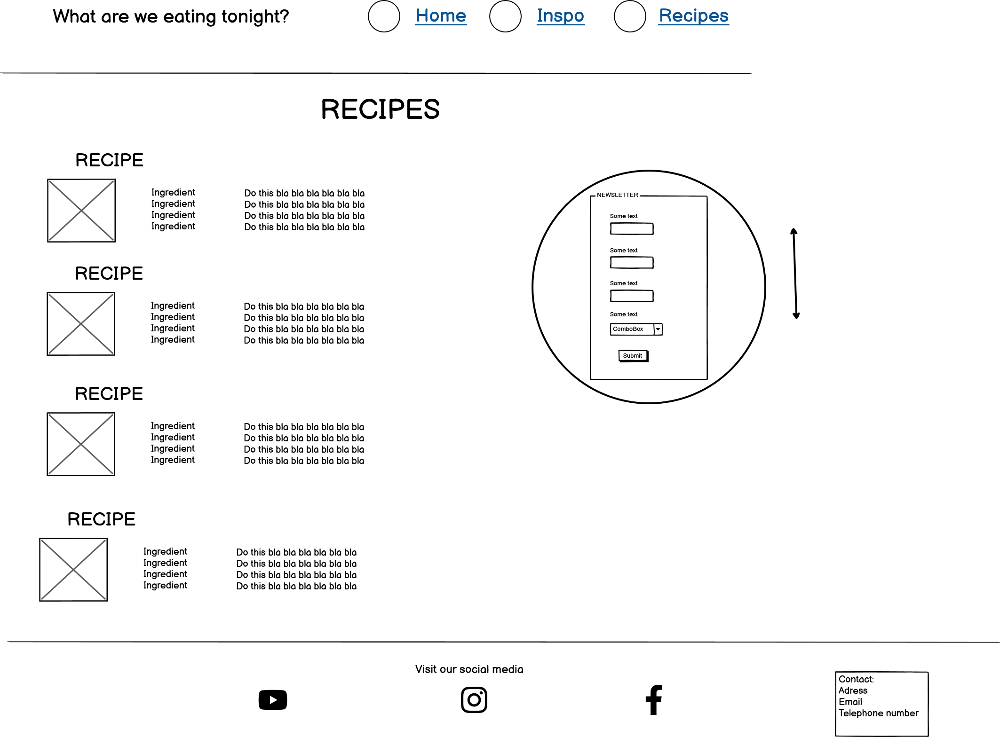
***

It is easy to see where the initial design idea differs from the result. The bootstrap carousel was implemented to not make the site to cluttered and to allow the user to focus on on dish at a time.

The contact feature in the footer was deleted due to not contributing to the user in this particular site.

### Other
One unfortunate design feature is the empty space between the h2-headings and the page top in the inspiration page and the recipe page. This is required to take the visitor to the correct place on the site when clicking the links in the menu (since the header is sticking to the top of the viewport).

Other solutions, like hiding a div in the page above and addressing the link there, where discarded.

## Features
This site contain three different sections in a single html-page:
- Landing page
- Inspo page
- Recipe page
### General Features on each page
**The header** sticks at the top of the viewport and gives the visitor access to the navigation bar anywhere on the site. When using a tablet or smaller, the menu bar hides behind a menu icon.

The h1-heading changes the amount of rows it is dispensed on depending on which device you are using. It is designed to make it fit better on smaller / larger screens.


**The Landing page** gives the visitor a short summary of what the page intend to do.

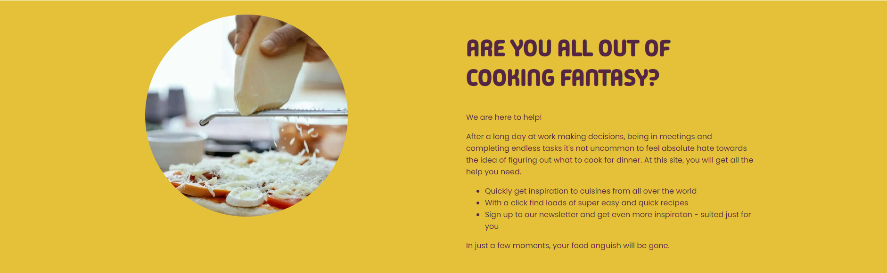

**The Inspiration page** gives the visitor inspiring pictures of delicious food with the names of the dishes, categorized under cuisine. The pictures are gathered in a bootstrap carousel to make it easy for the user to slide between images.


**The Recipe page** gives the visitor quick and easy recipes with 3-5 ingredients that takes only a few miuntes to assemble. The recipes are collapsed into cards, so at a first look the user only sees an image and the name of the dish. To show the full recipe, the user can click "Show Recipe". The button text then change to "Hide Recipe", with the inverted function. The cards system has a fault. When a recipe is opened, the rest of the cards on the same row adjusts their height to the clicked recipe. This will be changed in a future sprint.

The recipe page also has a newsletter sign up feature. At the bottom of the page there is a button that says "Want the newsletter?". Clicking it opens a modal with a form, allowing the user to sign up for the newsletter. The newsletter does not exist, and the user is taken to a page showing what information was submitted.


**The footer** is found at the bottom of the site. In the footer the visitor can find links to the social media pages. The social media pages does not exist, and the links open a new tab of the home page of that social media site.


The site is responsive - the design changes to be more compatible depending on which screen size the visitor uses.
### Future Implementations
The site has an infinite number of possibilites to incorporate. Some features that are planned but not yet executed are:
- The possibility for the visitor to enter preferred dishes and/or cuisines and get suggestions based on those preferences. 
- The possibility for the site to make suggestions based on what vegetables and fruits are in season in the visitors country at the moment. For a cheaper and more environment-friendly dish.
- The possibility for the site to gather information about prices at shops local to the visitor. For a cheaper dish.
- The possibility for the visitor to log what dishes and/or cuisines the visitor have eaten in the recent days/weeks and get suggestions based on those logs. For a more diverse eating experience.

### Accessibility
The site is made to be accessible. Measures taken are:
- High colour contrast between backround and text
- Alt attributes on all images
- Aria labels on all icons

## Technologies Used

### Languages Used
HTML and CSS were used to create this website.
### Frameworks, Libraries & Programs Used
Google Fonts -  For fonts

Git - For version control

Github - To save & store files and deployment

Gitpod & Visual Studio Code - IDE used to write the code

Font Awesome - For icons used in header and footer

Balsamiq - For wireframes

Bootstrap - For carousel and modal
## Deployment & Local Development

### Deployment
Github pages is used to deploy this site. To deploy the site yourself, follow these instructions:

- Sign in to Github
- Go to the repository for this project called [*what-are-we-eating*](https://github.com/mikael-johnsson/what-are-we-eating)
- Click *settings*
- In the column to the left, click *pages*
- From the dropdown, select *main branch* and then save
- The site is now deployed!
### Local Development

#### How to Fork
To fork the repository:

- Log in to Github


- Go to the repository for this project called *what-are-we-eating*

- Click the Fork button in the top right corner
#### How to Clone
- Log in (or sign up) to GitHub.

- Go to the repository for this project, [*what-are-we-eating*](https://github.com/mikael-johnsson/what-are-we-eating).

- Click *Code* and choose whether you would like to clone with HTTPS, SSH or GitHub CLI and copy the link.

- Open the terminal in your code editor and change the current working directory to the location you want to use for the cloned directory.

- Type the following command in the terminal (after the git clone you will need to paste the link you copied in step 3 above):

      git clone { & THE LINK FROM STEP 3 }


## Testing
### Automated testing
#### W3C
I have used W3C validator to validate my HTML code and CSS code. I validated them via direct input.

Both passed without errors. The warning in the CSS validation was regarding imported imported stylesheets - in this case the Google Fonts stylesheet.

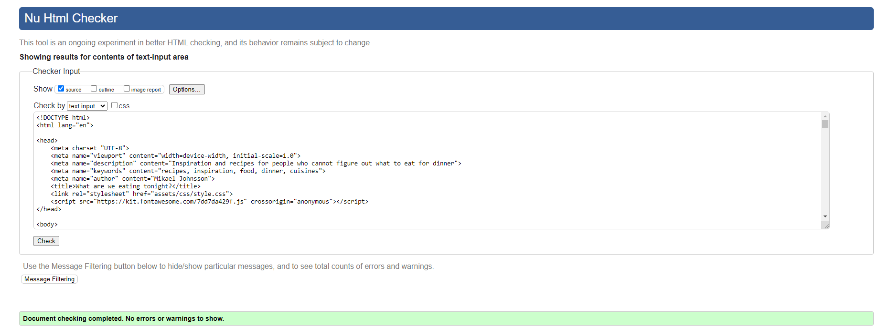


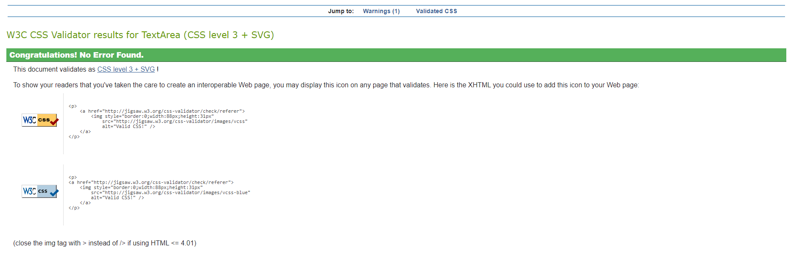
#### Lighthouse
Lighthouse is a tool created by Google to test a website's: Performance, Accessibility, Best Practices, SEO and Qualification as a Progressive Web Application.

It gives scores on the usability of the site. The test is done for a desktop version and a mobile version.

**The score for a mobile device:**

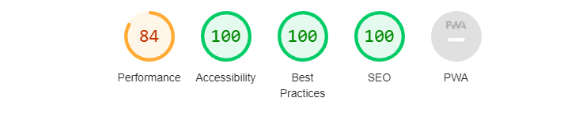


**The score for a desktop device:**

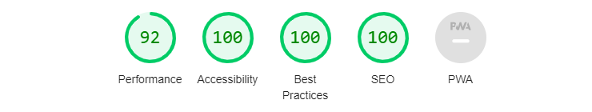

Overall the scores are good. For a mobile device, the performance is lacking a bit. This is mostly due to some images being larger than they need to be for a mobile screen.

#### WAVE
Wave is another tool to test the accessibility of the site. This is the result:

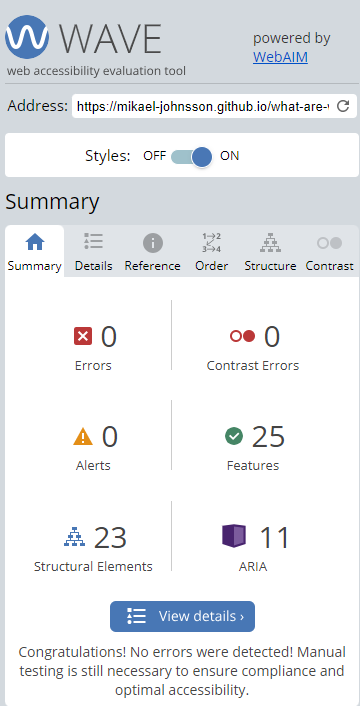

After the first test there was an error. It was that the label element in the navbar did not av any text content (only the menu icon). An Aria label was later added and the error was corrected.

### Manual Testing
#### Features
Below is a table with the sites features, how it has been tested and what the outcome were.

|Feature|Test case|Outcome|
|---|---|---|
|Header |Scroll down through site |Sticks to top of viewport |
|Nav bar - Home |Click |Redirected to landing page |
|Nav bar - Inspo |Click |Redirected to Inspiration page |
|Nav bar - Recipes |Click |Redirected to Recipe page |
|Nav bar - Icon (tablets and smaller) |Click |Menu shows |
|Newsletter form - hidden |Click |Newsletter form shows |
|Newsletter form|Give the required information|Form is successfully sent|
|Newsletter form (desktop)|Scroll down through site|The newsletter form sticks to top of viewport (under the header) inside Recipe page|
|Newsletter form - submit button|Click|Submits form|
|Newsletter form - reset button|Click|Resets form|
|Social media link - Instagram |Click |Redirected to Instagram |
|Social media link - Youtube |Click |Redirected to Youtube |
|Social media link - Facebook |Click |Redirected to Facebook |

#### Screen size compability
Below is a table with different devices and the outcomes when visiting the site using different screen sizes.

|Device|Site responsive <768px|Site responsive 768px to 991px|Site responsive 992px to 1919px| Site responsive >=1920px| Renders as expected |
|---|---|---|---|---|---| 
|Galaxy Fold |Good |N/A |N/A |N/A |Good |
|iPad Mini |N/A|Good |N/A |N/A |Good |
|Laptop (1366px wide) |N/A |N/A |Good |N/A |Good |
|Desktop (1920px wide) |N/A |N/A |N/A | Good|Good |

#### Browser compability
Below is a table with different browsers, how the site appears on them and how the sites responsiveness is on them.

|Browser|Intended appearance|Intended responsiveness|
|---|---|---|
|Chrome |Good |Good |
|Safari |Good |Good |
|Edge |Good |Good |
|Firefox |Good |Good |

## Credits

### Code Used
The following code where taken from Code Institutes *Love Running* project and later on adapted to this project.

```
  #menu-toggle {
        display: none;
    }

    #menu-toggle-label {
        font-size: 5rem;
        padding: 2rem 5rem 0 0;
        display: block;
    }

    #menu-toggle:checked~nav {
        display: block;
    }

    #menu-toggle:checked~label {
        display: none;
    }
 ```
    

### Content    
Recipes are taken from swedish recipe site https://www.köket.se

Remaining content is written by myself.
### Media
All images are licensed to use in commercial products. 
Images were taken from:

https://www.pexels.com
### Acknowledgments
Huge thank you to my Code institute mentor Graeme Taylor for offering excellent insights in good coding praxis.

Thank you to Kera Cudmore for creating the template and standard info used in this Readme.


